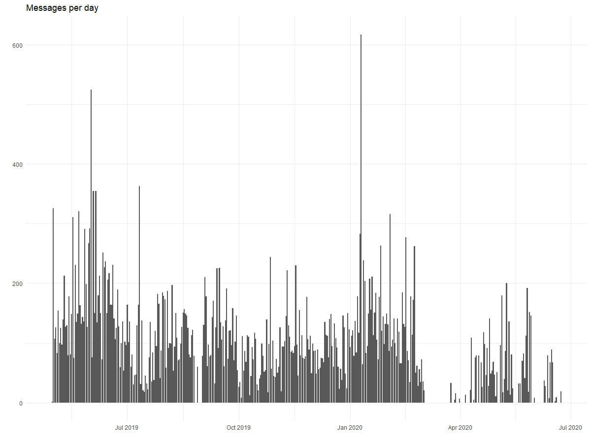
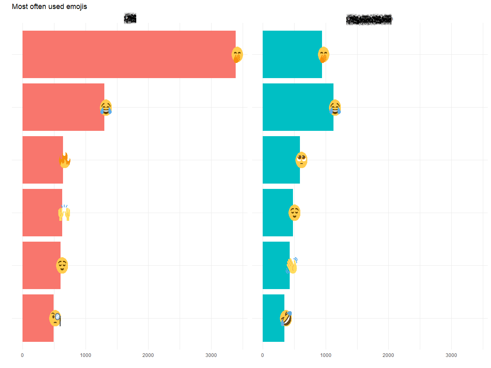
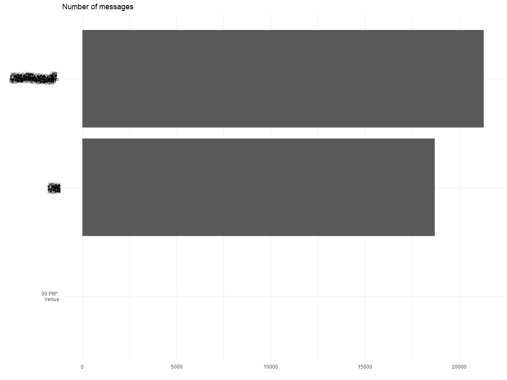
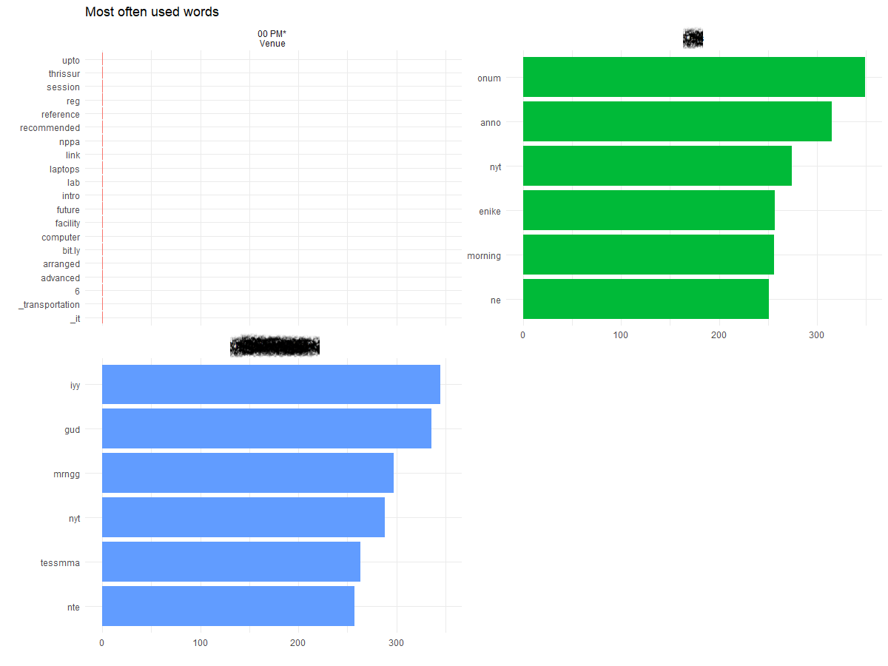
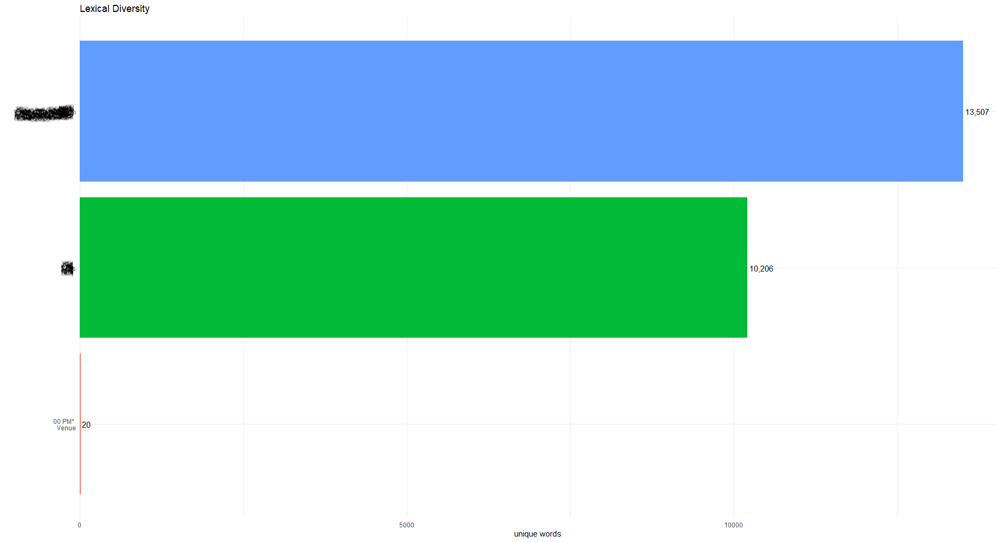
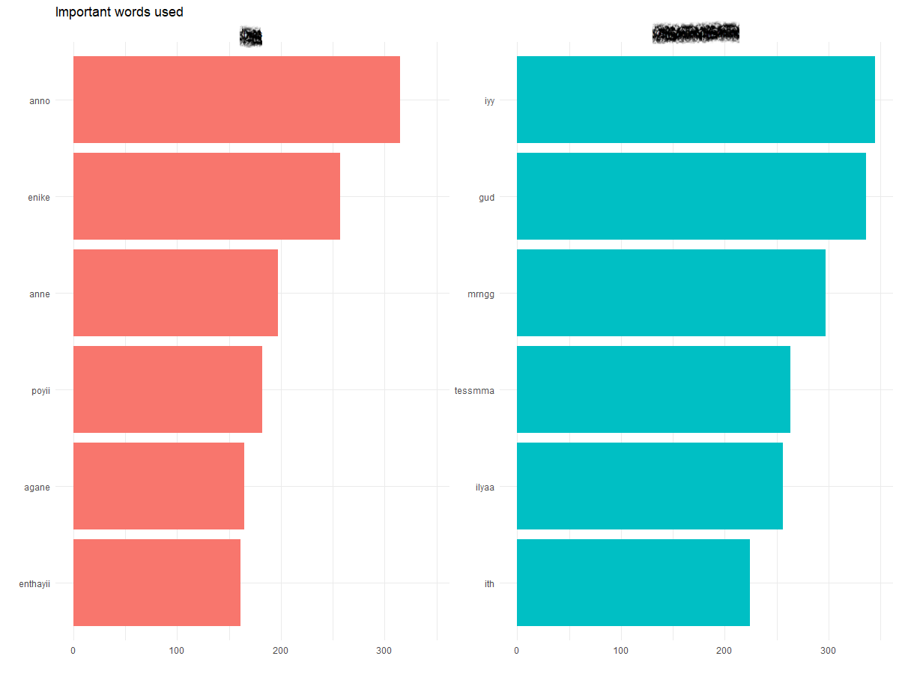
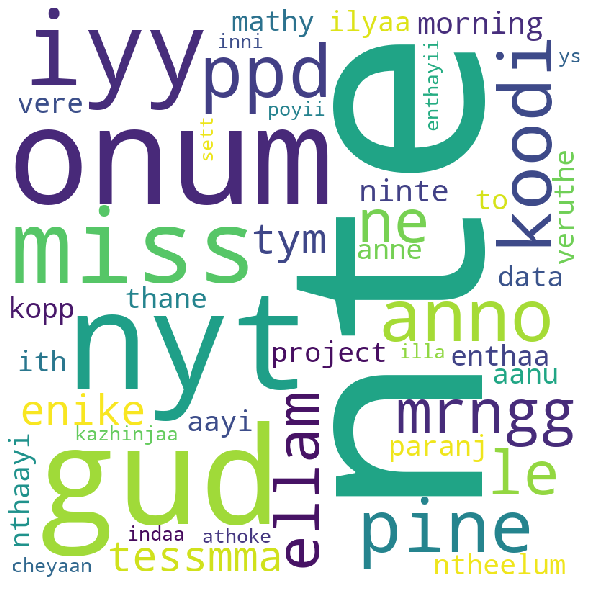

# Whatsapp-Chat-analysis:octocat:

Open:
```
EDA.R
```
📦 **Used R Packages**
```
 1. rwhatsapp
 2. dplyr
 3. ggplot2
 4. lubridate
 5. tidyr
 6. ggimage
 7. tidytext
 8. stopwords
```
## Statistical Analysing Using R
### Messages per day
 

### Most Often used Emojis
 

### Total Messages
 

### MostOften used words
 

### Lexical Diversity
 

### Important Words Used
 

## Word Cloud Using Python
 ```
Export 'chat_py.csv' from EDA.R and input that csv to Word_cloud.py 
 ```
 
